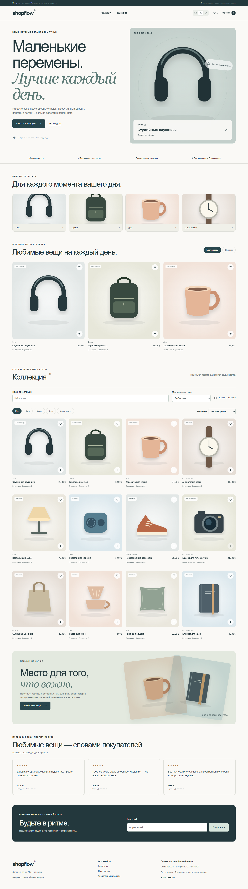
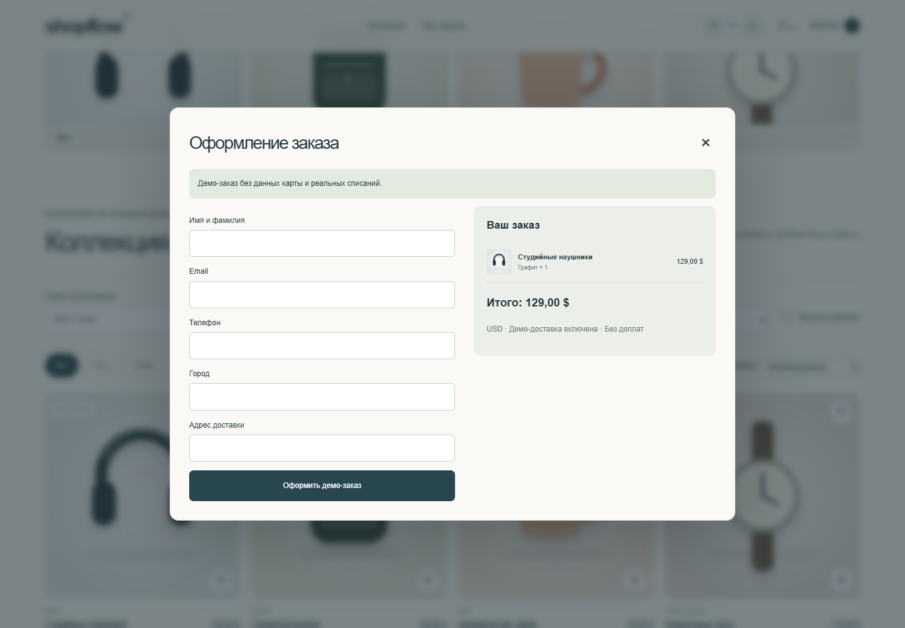

# ShopFlow

### Full-Stack Multilingual E-Commerce Platform

ShopFlow is a full-stack e-commerce application built with Flask and modern frontend technologies.

The project demonstrates a complete online-store workflow: product discovery, variants, favorites, recently viewed products, comparison, persistent cart, checkout, order management and a protected administration panel.

It was designed as a portfolio project with a strong focus on user experience, responsive design, maintainable backend architecture and production-ready configuration.

---

## ✨ Highlights

- 18 demo products across multiple categories
- Multilingual interface: **English / Russian / Ukrainian**
- Product colors and variants
- Variant-specific images and prices
- Search, filtering and sorting
- Product gallery
- Recently viewed products
- Wishlist / favorites
- Product comparison
- Persistent shopping cart
- Checkout flow
- Order history and status management
- Admin dashboard
- Product image upload and ordering
- Automated product translation workflow
- Stripe test / mock checkout support
- Optional Telegram order notifications
- PostgreSQL-ready architecture
- Responsive interface from desktop to mobile
- Automated backend test suite

---

## 🖼 Preview

### Storefront



### Checkout



> Additional responsive screenshots are available in `docs/qa/screenshots/`.

---

## 🛍 Customer Experience

ShopFlow provides a complete storefront experience instead of a simple product grid.

Customers can:

- browse the full collection;
- explore products by category;
- search products;
- filter and sort the catalog;
- switch between product colors and variants;
- view variant-specific images;
- save products to favorites;
- revisit recently viewed products;
- compare product characteristics;
- manage cart quantities;
- remove individual products from the cart;
- preserve cart state between page reloads;
- complete a checkout flow;
- switch the entire interface between EN / RU / UA.

The homepage also includes curated collections, mood-based product discovery, product storytelling, reviews and interactive product sections.

---

## 🎨 UI & Motion Design

The frontend was designed as a polished e-commerce experience rather than a traditional Flask template application.

The interface includes:

- responsive product layouts;
- animated page sections;
- interactive product cards;
- smooth transitions;
- product image interactions;
- carousel components;
- dynamic hero content;
- visual feedback for user actions;
- responsive navigation;
- motion-aware interface behavior;
- reduced-motion support where appropriate.

The visual system uses a soft mint, cream and peach palette with large typography and product-focused layouts.

---

## 🌍 Internationalization

ShopFlow supports three interface languages:

- 🇬🇧 English
- 🇷🇺 Russian
- 🇺🇦 Ukrainian

The selected language is persisted between sessions.

Localization covers:

- navigation;
- homepage content;
- catalog;
- filters;
- product details;
- variants;
- cart;
- checkout;
- validation messages;
- admin interface;
- order states;
- UI notifications.

Product content also supports localized names and descriptions.

---

## 🛒 Product Catalog

The demo catalog currently contains **18 products**.

Product functionality includes:

- categories;
- availability;
- stock quantity;
- badges such as Bestseller, New and Sale;
- product variants;
- colors;
- variant-specific media;
- variant-specific prices;
- product galleries;
- product specifications;
- related product interactions.

The catalog can be extended through the admin interface.

---

## 🛍 Shopping Cart

The shopping cart supports:

- add to cart;
- remove from cart;
- quantity controls;
- clear cart;
- variant preservation;
- automatic subtotal recalculation;
- persistent cart state;
- empty-cart states;
- checkout transition.

Different variants of the same product remain separate cart items.

---

## 💳 Checkout

ShopFlow includes a complete demo checkout workflow.

The application validates customer information on both the frontend and backend.

Order data includes:

- customer information;
- ordered products;
- variants;
- quantity;
- prices;
- totals;
- payment state;
- fulfillment state.

### Stripe

Stripe integration is designed for **test environments only**.

If Stripe credentials are not configured, ShopFlow automatically uses a clearly labeled demo checkout flow without charging money.

Live Stripe keys are intentionally rejected by the application.

---

## 🤖 Telegram Notifications

Telegram order notifications are optional.

When configured, ShopFlow can send information about a newly created order to an administrator, including:

- order ID;
- customer;
- products;
- selected variants;
- quantities;
- total amount.

If Telegram credentials are missing, the store continues working normally.

---

# 🛠 Admin Dashboard

ShopFlow includes a protected administration interface.

The dashboard provides:

- product overview;
- order overview;
- demo revenue metrics;
- fulfillment metrics;
- product search;
- product editing;
- image management;
- stock management;
- variant management;
- order search;
- order filtering;
- payment status;
- fulfillment status;
- order status history.

Administrators can upload product images, reorder them and manage product information without editing source files.

---

## 📦 Product Management

The admin interface supports:

- product name;
- SKU;
- category;
- price;
- stock;
- description;
- product variants;
- colors;
- variant pricing;
- cover image;
- gallery images;
- image ordering;
- availability.

Product translations can also be generated automatically through the translation workflow.

---

## 📋 Order Management

Administrators can inspect and manage orders directly from the dashboard.

Supported functionality includes:

- order search;
- filtering by fulfillment state;
- customer information;
- order totals;
- payment status;
- fulfillment status;
- status updates;
- status change history.

Dashboard calculations exclude cancelled orders from revenue totals.

---

# 🧱 Tech Stack

## Backend

- Python
- Flask
- Flask-SQLAlchemy
- Flask-WTF
- SQLAlchemy
- PostgreSQL / SQLite
- psycopg
- Waitress

## Frontend

- HTML5
- CSS3
- Vanilla JavaScript
- Responsive Design
- Custom animations and interactions

## Integrations

- Stripe API
- Telegram notifications
- MyMemory translation service

## Tooling

- Pytest
- python-dotenv
- Pillow
- Requests

---

# 🗄 Database

For local development ShopFlow can run with SQLite.

```text
instance/shopflow.db